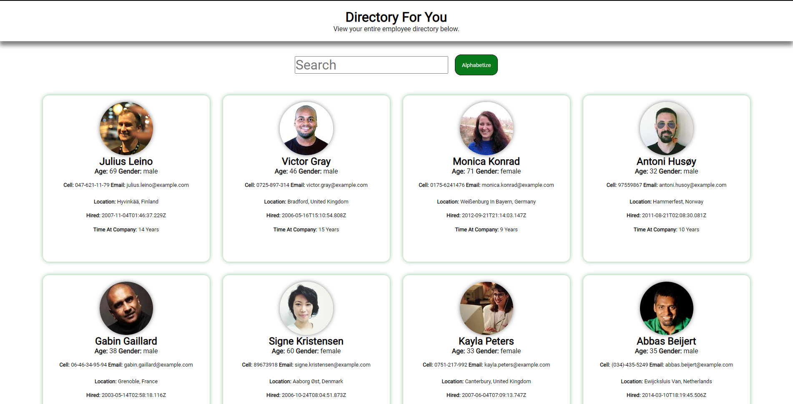

# directory-for-you

- An employee directory created with React which allows users to view an entire employee directory at once creating quick access to non-sensitive data. Users can search for specific employees are sort them alphabetically.

# User Story

- As a user, I want to be able to view my entire employee directory at once so that I have quick access to their information.

# Installation

- Clone the repo to your local development environment.
- Navigate to the directory-app folder using the command prompt.
- Run npm install to install all dependencies. in terminal or bash
- Run npm start to run the application in terminal or bash
